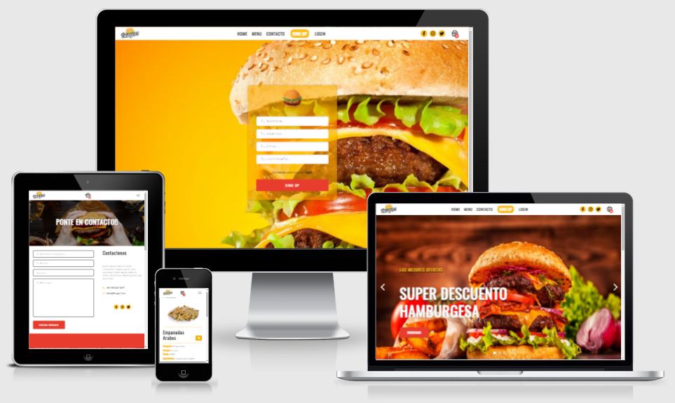
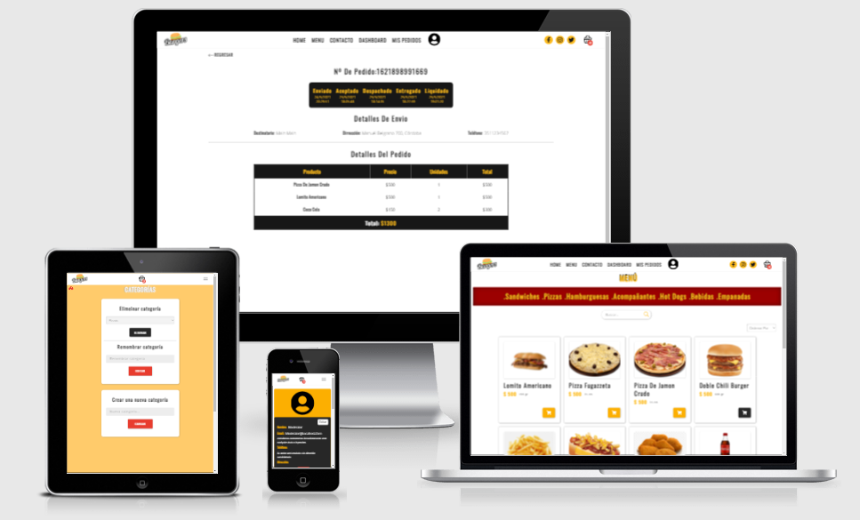

# burger-load-delivery-mern-app


> Food Burger Load Delivery App built with MERN plus Cloudinary and OAuth


### To SEE `admin` features

```yaml
email: moderator@localhost.com
password: moderator
```

## Environment variables

### MERN

```yaml
- HOST
- MONGODB_URI
- JWT_SECRET_KEY
- JWT_EMAIL_CONFIRMATION_KEY
- JWT_RESET_FORGOTTEN_PASSWORD_KEY
```

### oAuth2

```yaml
- OAUTH_USER
- OAUTH_CLIENT_ID
- OAUTH_CLIENT_SECRET
- OAUTH_REFRESH_TOKEN
```

### Cloudinary (Upload - DAM)

```yaml
- CLOUDINARY_NAME
- CLOUDINARY_KEY
- CLOUDINARY_SECRET
```

## Backend

### Technologies:

- Node.js/ Express
- MongoDB / Mongoose
- Json WTK
- oAuth2
- Nodemailer
- Multer
- Cloudinary
- socket.io

### Features:

- Authentication using Json Web Tokens
- password encryption using bcrypt library
- account validation, and functional contact form using Nodemailer and googleapis oAuth2
- Access of routes base authorization and permissions.
- Media storage using multer library and cloudinary service.
- Real time new orders and order actualization notifications.
- **request supported** : GET, PUT, POST, DELETE
- **routes:** USERS , PRODUCTS, CATEGORIES, ORDERS,NEWSLETTER, CONTACT, AUTH (Login/Sing Up/forgotPassword/resetPassword),
- INITIAL mongoose set up with : default categories, roles and admin and moderator users.

## Frontend

### Technologies and tools:

- React.js
- Styled-Components
- React-hook-form
- React-router-dom
- React hooks
- Swiper
- Socket.io-client

### Features:

- Interaction with the backend through API Rest.
- Unit test examples.
- Lazy Load components and code splitting.
- Products and orders section skeletons.
- Custom Auto-played sliders with dot indicators and controls.
- Latest products carrousel using swiper.js library.
- Navbar responsive and animated.
- Complete authentication system width signup/email validation/login/forgot password support.
- Access to Public and Private routes base on roles.
- Functional contact section with form validation.
- Loading modal and loading form indicators.
- Shopping cart.
- Editable User profile.
- Products and orders section with sorter, filter and search bar.
- URL able to storage the user search
- pagination.
- User orders tracker page.
- Real time order notifications.
- Dashboard with users, categories, orders and products management system.

## Screenshots





&copy; 2022 @devmaster518 All Rights Reserved.
